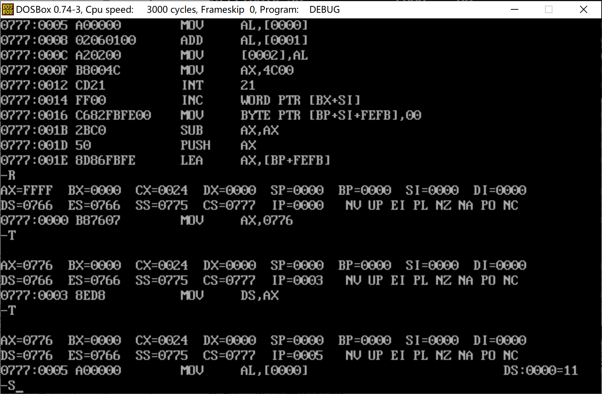

# 汇编语言第1次上机

| 班级       | 学号       | 姓名   |
| ---------- | ---------- | ------ |
| 计算机2205 | 2204112913 | 李雨轩 |

## 1. 熟悉汇编语言实验环境（`masm`、`link`、`debug`）

### (1) 使用`masm`编译`demoadd.asm`，同时生成`.lst`、`.crf`文件，给出运行结果截图。


###  (2) 使用`link`编译`demoadd.obj`，同时生成同名的`.map`文件，给出运行结果截图。


### (3) 使用`debug`调试`demoadd.exe`，按下面的要求分别给出结果截图。

####  (a) 反汇编指令 `U`


#### (b) 显示寄存器指令 `R`


#### (c) 单步调试指令 `T`, 执行2次 `T` 指令后的结果



#### (d) 显示内存指令 `D`，显示 数据段 前3的个字节的内容


#### (e) 执行程序指令 `G`，运行到 `add   al,  Y` 行


#### (f) 执行程序指令 `G`


## 2. 算术指令程序设计。在数据段分别定义stu，X,Y,Z,W变量。其中，将stu初始化为自己的学号，X,Y,W可以任意初始化。截图中stu的初始值和学号不相符的将判定为抄袭。（说明：为简化编程，除法运算后不考虑余数）

### (1) 汇编、连接后的截图


### (2) 反汇编的截图


### (3) 在进行计算前，显示变量stu、X、Y、Z、W的内存值的截图（只能显示这5个变量的内存值，多显示、少显示均扣分）


### (4) 执行完计算后，显示变量stu、X、Y、Z、W的内存值的截图（只能显示这5个变量的内存值，多显示、少显示均扣分）


### (5) 源代码

```assembly
; Arithmetic Instruction Programming

; Arithmetic instruction programming. Write a complete program to implement
; Z = ( ( W – X ) / 5 * Y ) / 2
; where X, Y, Z, W are all 8-bit signed integers
; (For simplification, remainders are not considered after division)

name arith
title arithematic instruction program design
	
data segment
	stu db '2204112913'
	X db 30
	Y db 20
	Z db ?
	W db 40
data ends

code segment
	assume cs: code, ds: data

	main proc far
		; Prepare for return to DOS
		push ds
		xor ax, ax
		push ax
		; Initialize data segment
		mov ax, seg data
		mov ds, ax
		xor ax, ax
		; Load value to register
		mov al, W
		mov bl, 5 
		; Calculate the result
		sub al, X ; W - X
		idiv bl	  ; ( W – X ) / 5
		imul Y	  ; ( W – X ) / 5 * Y

		and ax, 00FFh; If consider Overflow???
		shr al, 1 ; ( ( W – X ) / 5 * Y ) / 2
		mov Z, al

		ret
	main endp

code ends
	end main
```


## 3. 寄存器使用程序设计。寄存器BL、CL的值根据需要进行初始化。（说明：为简化编程，除法运算后不考虑余数）

### (1) 反汇编的截图


### (2) 在进行计算前，显示寄存器的值截图


### (3) 执行完计算后，显示寄存器的值截图


### (4) 源代码

```assembly
; 寄存器使用程序设计。编写完整程序，
;	要求把BL中的数除以CL中的数，并把其商乘以2，
;	最后结果存入DX寄存器中

; 寄存器使用程序设计。
; 寄存器BL、CL的值根据需要进行初始化。
; （说明：为简化编程，除法运算后不考虑余数）

NAME REGISTER
TITLE arithematic instruction program design


data segment
	cl_number db 8
	bl_number db 16
data ends

code segment
	assume cs: code, ds: data

	main proc far
		; Prepare for return to DOS
		push ds
		xor ax, ax
		push ax
		; Initialize data segment
		mov ax, seg data
		mov ds, ax
		xor bl, bl
		; Load data
		mov bl, bl_number
		mov cl, cl_number
		; calcualte
		mov al, bl
		cbw
		idiv cl
		shl ax, 1
		mov dx, ax

		ret
	main endp

code ends
	end main
```

