# 汇编语言第2次上机

| 班级       | 学号       | 姓名   |
| ---------- | ---------- | ------ |
| 计算机2205 | 2204112913 | 李雨轩 |

## 1. 循环程序设计

#### (1). 反汇编的截图

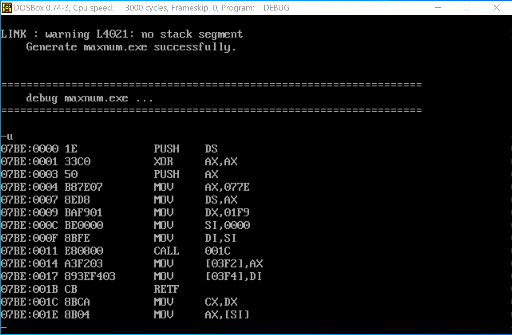

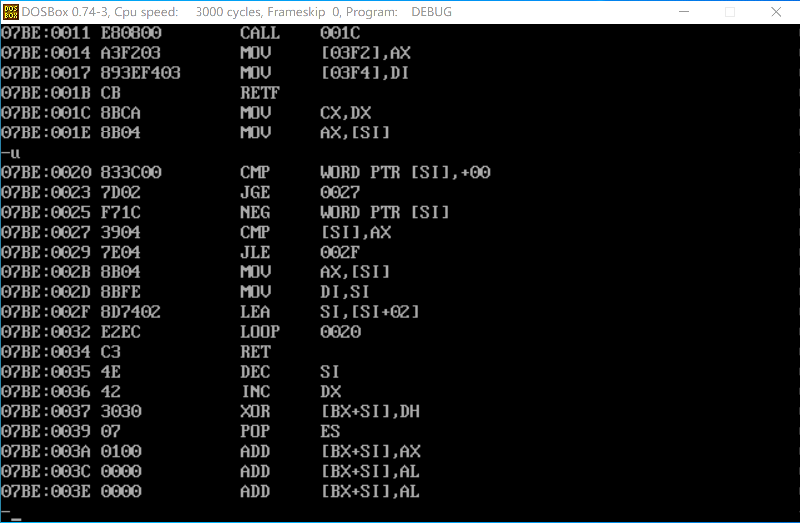

#### (2). 在进行计算前，显示数组M开始的n+2个字的内存值的截图（只能显示这n+2个字的内存值，多显示、少显示均扣分）

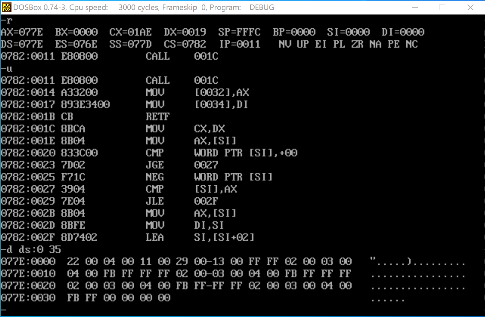

#### (3). 执行完计算后，显示数组M开始的n+2个字的内存值的截图（只能显示这n+2个字的内存值，多显示、少显示均扣分）

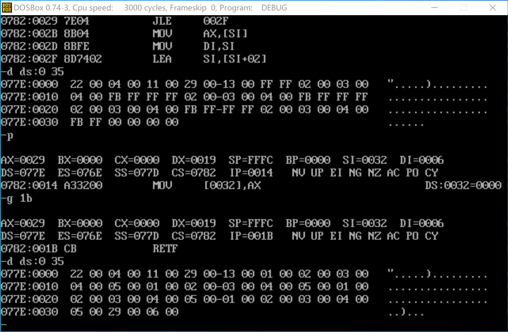

#### (4). 源代码

```assembly
name MaxNumber
title Find Max Number

data segment
;	length dw 16
	array label word
	dw 22h, 04h, 11h, 29h, 13h
	dw 4  dup(-1,2,3,4,-5)
	arrend label word
	max dw ?
	ofs dw ? ;store the first max number
data ends


code segment
	assume cs:code, ds:data

	main proc far
		push ds
		xor ax, ax
		push ax
		mov ax, data
		mov ds, ax
		mov dx, (arrend - array)/2; get array's length
		mov si, offset array
		mov di, si
		call findMax
		mov max, ax
		mov ofs, di

		ret
	main endp

	findMax proc near
	; dx - length, si - array, di - max_index
	; return the max num in ax

		mov cx, dx
		mov ax, [si]; ax stores the max number

loopH:	cmp word ptr [si], 0;
		jnl short whennl
		neg word ptr [si]
whennl:	cmp [si], ax
		jng short whenng
		mov ax, [si]
		mov di, si
whenng:	lea si, 2[si]
		loop loopH

		ret
	findMax endp

code ends
	end main
```


## 2. 分支程序设计

#### (1). 反汇编的截图

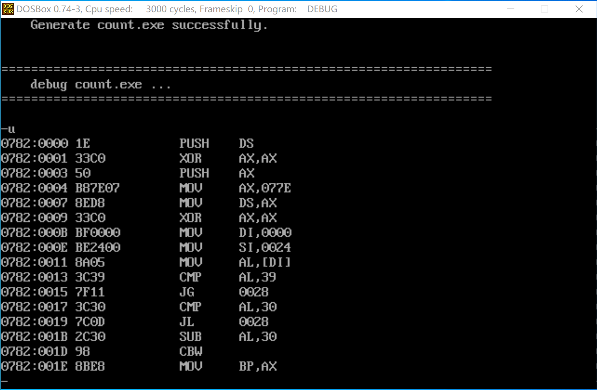

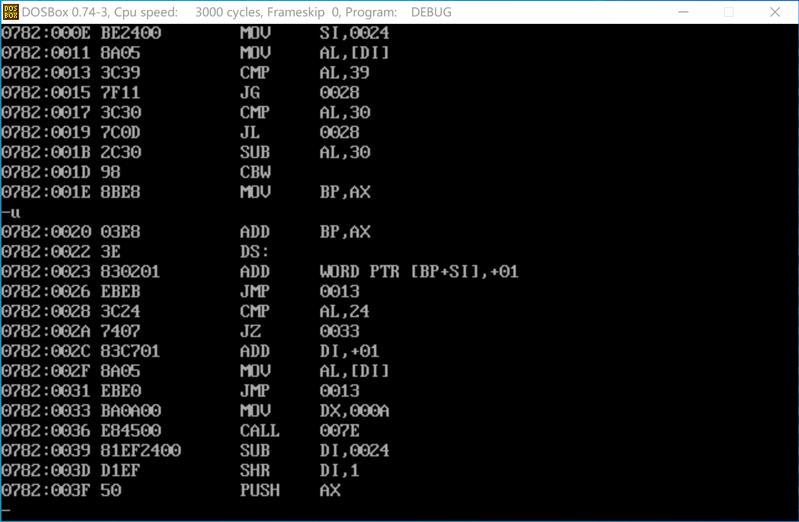

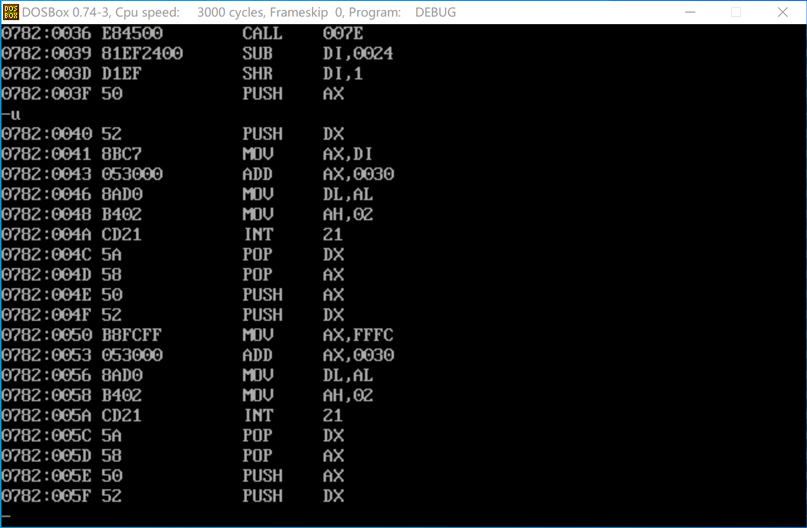

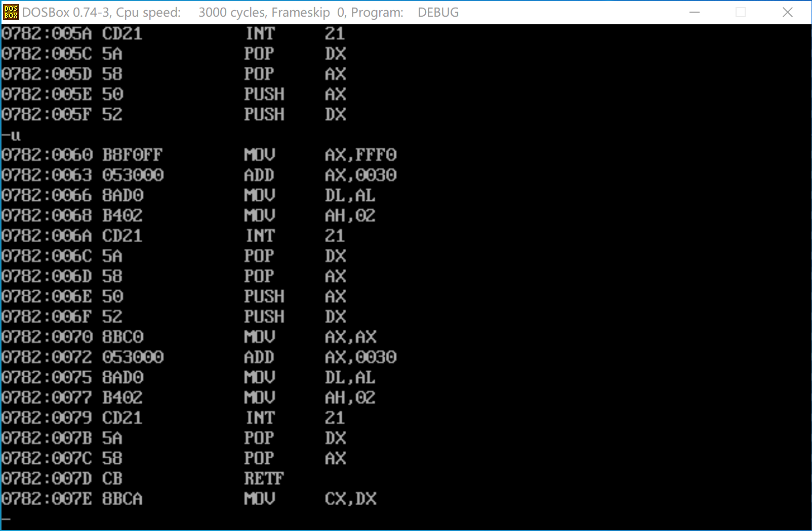

#### (2). 在进行计算前，显示在数据段中定义的含学号的字符串的内存值的截图（只能显示该完整的字符串，多显示、少显示均扣分）

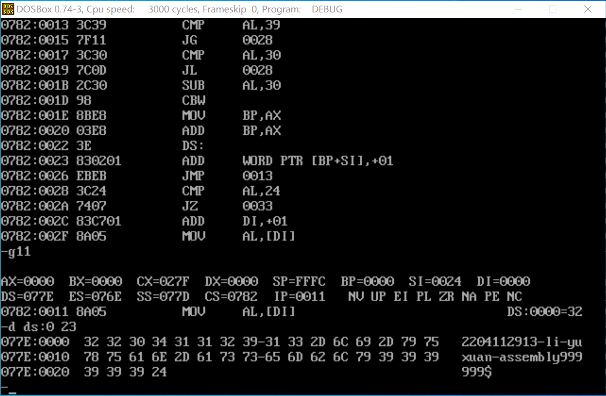

#### (3). 在进行计算前，显示在数据段中定义的COUNT数组的内存值的截图（只能显示完整的COUNT数组内容，多显示、少显示均扣分）

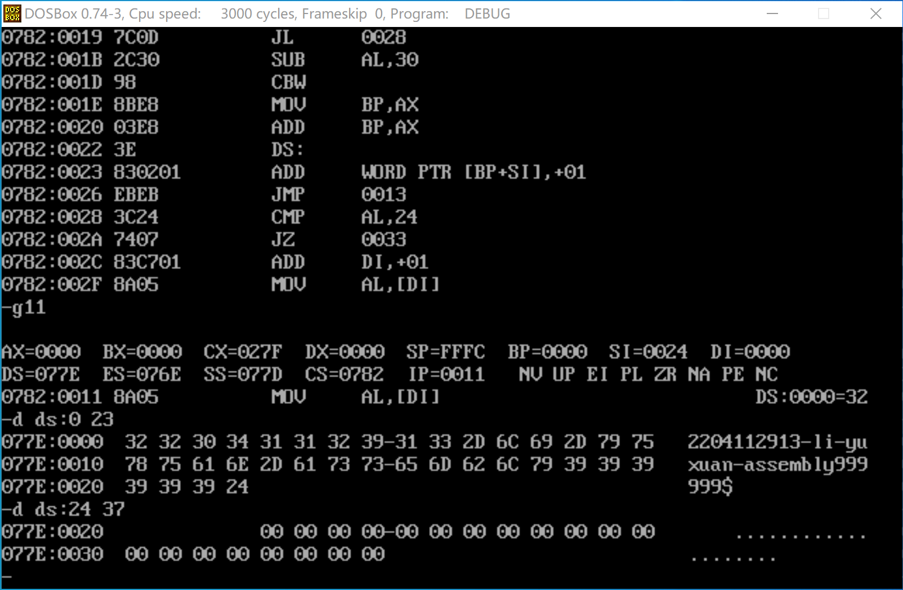

#### (4). 执行完计算后，显示在数据段中定义的含学号的字符串的内存值的截图（只能显示该完整的字符串，多显示、少显示均扣分）

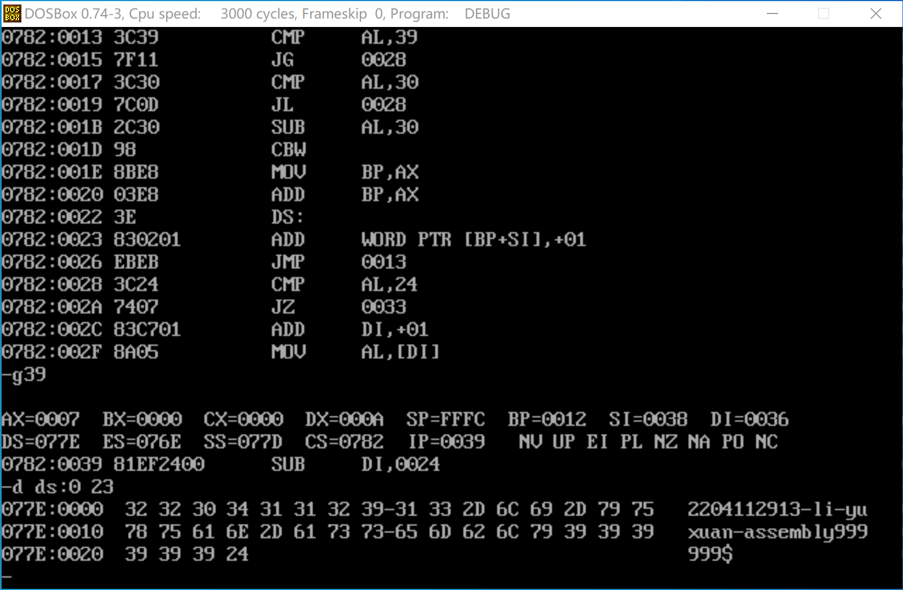

#### (5). 执行完计算后，显示在数据段中定义的COUNT数组的内存值的截图（只能显示完整的COUNT数组内容，多显示、少显示均扣分）

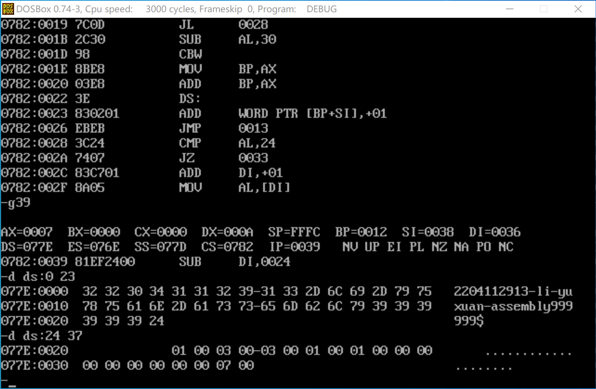

#### (6). 程序在DOSBox下直接运行的截图

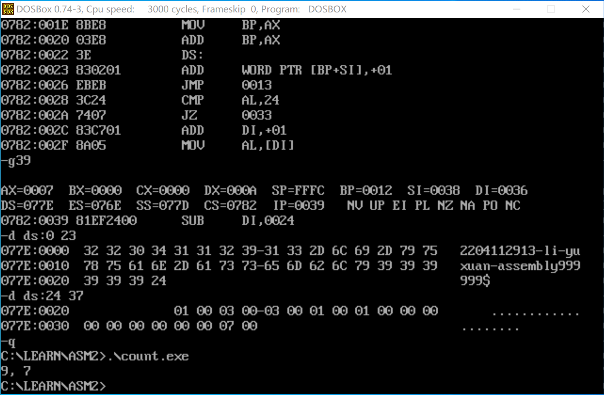

#### (7). 源代码

```assembly
printnum macro num
	push ax
	push dx
	mov ax, num
	add ax, 30h
	mov dl, al
	mov ah, 02h
	int 21h
	pop dx
	pop ax
endm

name CountString
title Count String

data segment
	mystring db '2204112913-li-yuxuan-assembly999999$'
	countarray dw 10 dup(0)
	tests db 9
data ends


code segment
	assume cs:code, ds:data

	main proc far
		; init
		push ds
		xor ax, ax
		push ax
		mov ax, data
		mov ds, ax
		xor ax, ax

		; count number
		mov di, offset mystring
		mov si, offset countarray
		mov al, ds:[di]

begin:	cmp al, 39h
		jg short incr
		cmp al, 30h
		jl short incr
		sub al, 30h

		cbw
		mov bp, ax
		add bp, ax
		add word ptr ds:[bp+si], 1

		jmp short begin

incr:	cmp al, '$'
		je short endstr
		add di, type mystring
		mov al, ds:[di] 
		jmp short begin

endstr:	mov dx, length countarray
		
		call findMax
		sub di, offset countarray
		shr di, 1
		printnum di
		printnum ','-30h
		printnum ' '-30h
		printnum ax
		
		ret
	main endp


	findMax proc near
	; dx - length, si - array, di - max_index
	; return the max num in ax

		mov cx, dx	; length
		mov ax, [si]; ax stores the max number

loopH:	cmp word ptr [si], 0;
		jnl short whennl
		neg word ptr [si]
whennl:	cmp [si], ax
		jl short whenl
		mov ax, [si]
		mov di, si
whenl:	lea si, 2[si]
		loop loopH

		ret
	findMax endp


code ends
	end main
```

