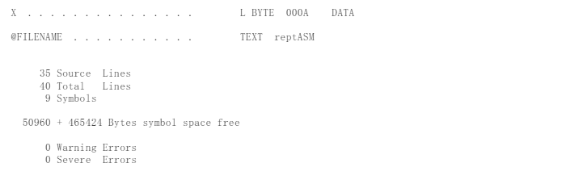

# 汇编语言第3次上机

| 班级       | 学号       | 姓名   |
| ---------- | ---------- | ------ |
| 计算机2205 | 2204112913 | 李雨轩 |

## 1. 子程序设计

> 设有10个学生的成绩分别是76, 69, 84, 90, 73, 88, 99, 63, 100和80分。试编制一个子程序统计60~ 69分，70~ 79分，80~ 89分，90~99分和100分的人数并分别存放到`S6, S7, S8, S9`和`S10`单元中。数据段中至少需要定义以下内容：
>
> （1）  `ID  db  ‘2186123456’` (说明：以学号2186123456为例，此处应更换为自己的学号) （2） ` array  db ...`   (存放10个学生的成绩) （3）  定义`S6，S7，S8，S9，S10`的内存单元
>

### 1.1 反汇编的截图


### 1.2 在进行计算前，显示ID、array以及S6——S10的内存值的截图（多显示、少显示均扣分）


### 1.3 执行完计算后，显示ID、array以及S6——S10的内存值的截图（多显示、少显示均扣分


### 1.4 源代码

```assembly
name Score
title Count students score

MSG MACRO COUNT
	S&COUNT DB 0
ENDM

data segment
	ID  db  '2204112913'
	array db 76, 69, 84, 90, 73, 88, 99, 63, 100, 80
	counts label byte
	X = 6
	REPT 5
		MSG %X
		X = X + 1
	ENDM
data ends

code segment
	assume cs:code, ds:data

	main proc far
		push ds
		xor ax, ax
		push ax
		mov ax, seg data
		mov ds, ax

		mov di, offset array
		mov si, offset counts
		mov dx, counts - array
		call countScore

		ret
	main endp

	countScore proc near 
	    mov cx, dx

count_scores:
	    mov al, [di]

	    cmp al, 100
	    je  increment_S10
	    cmp al, 90
	    jge increment_S9
	    cmp al, 80
	    jge increment_S8
	    cmp al, 70
	    jge increment_S7
	    cmp al, 60
	    jge increment_S6
	    jmp next_student

increment_S10:
	    inc byte ptr S10
	    jmp next_student
increment_S9:
	    inc byte ptr S9
	    jmp next_student
increment_S8:
	    inc byte ptr S8
	    jmp next_student
increment_S7:
	    inc byte ptr S7
	    jmp next_student
increment_S6:
	    inc byte ptr S6
next_student:
	    inc di
	    loop count_scores
	    ret
	countScore endp

code ends
	end main
```


## 2. **高级汇编语言技术**

>
> 试使用条件汇编和重复汇编编写一段程序，完成以下功能：根据给定名为X的字符串长度汇编以下指令，如果X的长度为n，当n<=5时，汇编n次；当n>5时，汇编6次。  `ADD   AX, AX`
>
> 数据段中至少需要定义以下内容：
>
> 	（1）  `ID  db ‘2186123456’` (说明：以学号2186123456为例，此处应更换为自己的学号)  	（2）  X   是一个目标字符串，根据下面的测试场景需求进行定义；  	（3）  从这里定义自己认为必要的变量
>
> 测试场景要求：
>
> 	（1）  X 是一个长度为5 的字符串，例如：'23456'   ; 学号的后5位  	（2）  X 是一个长度为10的字符串，例如：'2186123456'      ; 完整的学号  	（3）  测试时，只能改变数据段中X的定义内容（通过注释符号），其它数据段、代码段中的内容必须保持不变。
>

### 2.1 场景1的.lst文件的截图




### 2.2 场景1的反汇编的截图


### 2.3 场景1的显示X的内存值的截图（多显示、少显示均扣分）


### 2.4 场景2的.lst文件的截图


### 2.5 场景2的反汇编的截图


### 2.6 场景2的显示X的内存值的截图（多显示、少显示均扣分）


### 2.7 源代码

```assembly
name REPTASM
title conditional Assembly and repitition Assembly

data segment
    ID db '2204112913'

    strBegin label byte
    X db '2204112913'
    strEnd label byte

data ends

code segment
    assume cs:code, ds:data
    main proc far
        mov ax, seg data
        mov ds, ax
        mov ax, strEnd-strBegin

    IF strEnd-strBegin LE 5 ; if length of string is less than or equal to 5
        REPT strEnd-strBegin
            add ax, ax
        ENDM
    ELSE
        REPT 6
            add ax, ax
        ENDM
    ENDIF

        mov ax, 4c00h
        int 21h
    main endp
    
code ends
    end main
```

