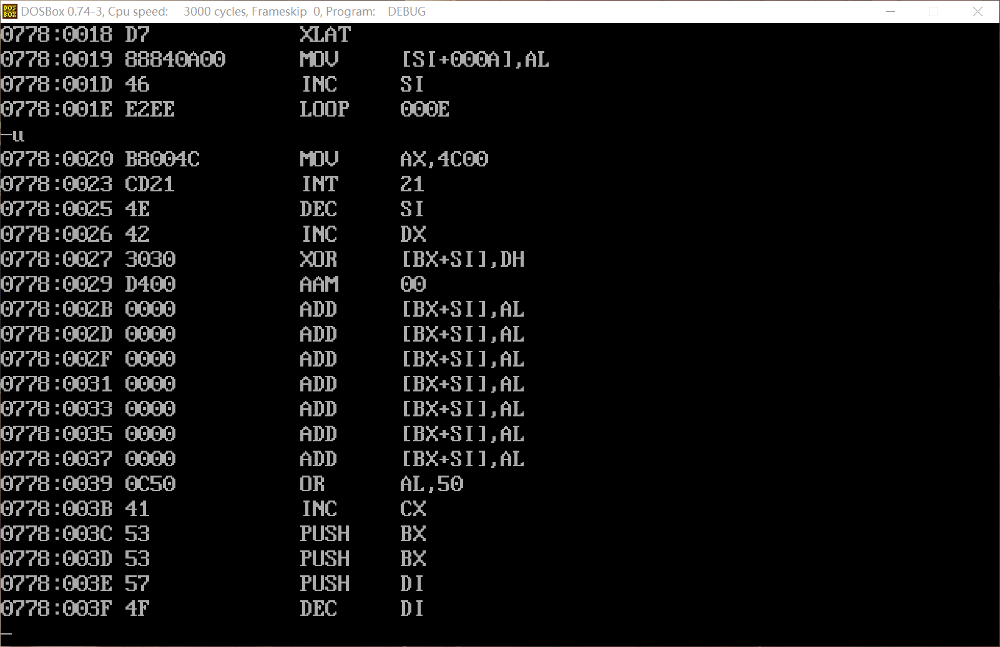

# 汇编语言第4次上机

| 班级       | 学号       | 姓名   |
| ---------- | ---------- | ------ |
| 计算机2205 | 2204112913 | 李雨轩 |

## 1. 中断子程序设计

> 编写程序，使类型 `1CH` 的中断向量指向中断处理程序 `COUNT`，`COUNT` 统计 `1CH` 中断次数并存入字变量单元`NUM` 中。程序启动后等待用户输入，输入字符 `Q` 后退出，并将 `NUM` 值用十六进制形式显示出来。例如 `NUM` 的内容为 `1234h`，则在屏幕上显示 `1234h`。
>
> 数据段中至少需要定义以下内容：
>
> （1） ` ID db  '2186123456' ` (说明：以学号`2186123456`为例)
>
> （2）  定义中断次数 `NUM` 的内存单元

#### （1）反汇编的截图


#### （2）在进行计算前，显示 `ID`、`NUM` 的内存值的截图（多显示、少显示均扣分）


#### （3）运行到返回 `dos` 前暂停，对屏幕显示的输出结果（ `NUM` 值的对应的 `ASCII` 字符串）截图【结果要与步骤（4）中的内存值一致】


#### （4）在完成步骤（3）操作后，立即显示 `ID` 、`NUM` 的内存值的截图（多显示、少显示均扣分）


#### （5）源代码

```assembly
name Interrupt
title Int sub-program

assume cs:code, ds:data

addr struc
    offsets dw ?
    segments dw ?
addr ends

data segment
    ID db '2204112913'
    NUM dw 0
    IADDR addr <>
    crlf db 0DH, 0AH, '$'
data ends

code segment
    main proc far
        mov ax, seg data
        mov ds, ax

        ; get the interrupt vector
        mov ah, 35h
        mov al, 1ch
        int 21h
        mov ax, es
        mov IADDR.offsets, bx
        mov IADDR.segments, ax

        ; set the interrupt vector
        push ds
        mov dx, offset COUNT
        mov ax, seg COUNT
        mov ds, ax
        mov ah, 25h
        mov al, 1ch
        int 21h
        pop ds

        ; enable the timer tick interrupt
        in al, 21h
        and al, 11111110b
        out 21h, al
        sti

        ; wait for the user to press 'Q'
        mov ah, 1
    waitForKey:
        int 21h
        cmp al, 'Q'
        jne waitForKey

        ;print crlf
        mov ah, 09h
        lea dx, crlf
        int 21h

        ; reset the interrupt vector
        push ds
        mov ax, IADDR.segments
        mov dx, IADDR.offsets
        mov ds, ax
        mov ah, 25h
        mov al, 1ch
        int 21h
        pop ds

        mov bx, NUM
        call HexShot

        mov ax, 4c00H
        int 21h

    main endp

    COUNT proc far
        push ax
        mov ax, data
        mov ds, ax

        sti
        inc NUM
        cli

        pop ax
        iret
    COUNT endp

    ; print the number in bx in hexadecimal
    HexShot proc
        push ax
        push cx
        push dx

        mov cx, 4
        print_digit:
            rol bx, 1
            rol bx, 1
            rol bx, 1
            rol bx, 1
            mov dl, bl
            and dl, 0Fh
            cmp dl, 9
            jg convert_letter
            add dl, '0'
            jmp print_done
        convert_letter:
            add dl, 'A' - 10
        print_done:
            mov ah, 02h
            int 21h
            loop print_digit

        ;print "h"
        mov dl, 'h'
        mov ah, 02h
        int 21h
            
        pop dx
        pop cx
        pop ax
        ret
    HexShot endp
code ends
    end main
```

## 2. `BIOS` 和 `DOS` 中断

> 编写一个程序，接收从键盘输入的 `10` 个十进制数字（你的学号），输入回车符则停止输入，然后将这些数字加密后（用 `XLAT` 指令变换）存入内存缓冲区 `BUFFER` 。加密表为：
>
> 输入数字：  ` 0，1，2，3，4，5，6，7，8，9`
>
> 密码数字：   `7，5，9，1，3，6，8，0，2，4`
>
> 数据段中至少需要定义以下内容：
>
> （1） ` ID  db  '2186123456' `(说明：以学号 `2186123456` 为例)   
>
> （2） ` BUFFER  db  10 dup (?)`

#### （1）反汇编的截图




#### （2）在进行计算前，显示`ID`、`BUFFER`的内存值的截图（多显示、少显示均扣分）


#### （3）输入回车后，显示`ID`、`BUFFER` 的内存值的截图（多显示、少显示均扣分）


#### （4）源代码

```assembly
name Password
title Set Password

assume cs:code, ds:data

data segment
    ID      db '2204112913'
    BUFFER  db 10 dup(?)
    TABLE   db 7, 5, 9, 1, 3, 6, 8, 0, 2, 4
data ends

code segment
    
    main proc far
        mov ax, seg data
        mov ds, ax
        mov bx, offset TABLE
        mov si, 0

        mov cx, 10
    read_loop:
        mov ah, 01h
        int 21h
        cmp al, 0Dh
        je read_done

        sub al, '0'
        xlat
        mov BUFFER[si], al
        inc si
        loop read_loop
    read_done:
        
        mov ax, 4c00h
        int 21h

    main endp

code ends
    end main
```

