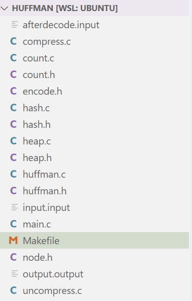

# 实验11：哈夫曼压缩/解压缩算法（编译码器）

## 题目描述

利用哈夫曼编码进行信息通信可以大大提高信道利用率，缩短信息传输时间，降低传输成本。但是，要求在发送端通过一个编码系统对传输数据预先编码（压缩）；在接收端将传来的数据进行译码（解压缩复原）。试为这样的通信站编写一个哈夫曼编译码系统---哈夫曼压缩/解压缩算法。

基本要求是：1）通信内容可以是任意的多媒体文件；2）自己设定字符大小，统计该文件中不同字符的种类（字符集、个数）、出现频率（在该文件中）；3）构建相应的哈夫曼树，并给出个字符的哈夫曼编码；4）对源文件进行哈夫曼压缩编码形成新的压缩后文件（包括哈夫曼树）；5）编写解压缩文件对压缩后文件进行解码还原成源文件。

## 解题思路

为实现哈夫曼的压缩和解压缩，首先需要统计原始文本的字符信息，比如对于字符X他的出现频率。然后根据出现的频率构建一颗哈夫曼树。接下来，根据构建的哈夫曼树绘制编码表。

在完成编码表的构建后开始写入文件。首先是文件头部，文件头部主要写入原始文件的字符个数以及编码表。然后根据编码表中的编码写入正文。**其中值得一提的是，编码写入的过程中将对编码表<u>构建了一个Hash表，键值为编码对应的原始字符，这样能节约编码写入的时间。</u>**

同时，由于C只能对字节操作，因此在写入时先建立一个缓冲区，对每八个bit值（实现时是选择了一个长度为8的0-1数组）转化为一个长度为1字节的字符写入文件，**也就是说，<u>这一步将bit流转化为字节流写入文件</u>**。

在解码时，首先应读取编码表，进而根据编码表还原一个哈夫曼树以方便解码。

解码过程中，首先要再次建立一个缓冲区，与写入时一样，<u>**将读入的字节流转化为bit流**</u>，进而与还原的哈夫曼树进行匹配，每匹配到了一个字符即清空缓冲区并写入输出文件。


## 大致的算法
### 总体结构
代码主题由`main`以及`compress`压缩部分和`uncompress`解压缩部分构成，此外还有`huffman.c`及`huffman.h`用以构建huffman树，`hash.c`及`hash.h`用以构建hash表，`heap.c`及`heap.h`用以构建一个优先队列，用以辅助构建huffman树。同时，还有`count.h`和`count.c`以处理原始的读入文件，进行初始的文本分析。如图所示



### `hash`以构建hash表
实现了一个基于开放寻址法的哈希表。以下是对代码的算法分析：
1. `cmpArray` 函数
```c
bool cmpArray(bool *array1, bool *array2, int length)
```
该函数用于比较两个布尔数组是否相等。它通过逐一比较数组中的元素，如果有任何不同的元素，则返回false；否则，返回true。

2. `hash` 函数
```c
unsigned long hash(HashKey key)
```
该函数实现了一个简单的哈希算法，用于将给定的哈希键（HashKey）映射为一个无符号长整型数。具体来说，它对哈希键中的布尔数组进行处理，将每个布尔值转换为整数（0或1），然后使用一系列运算（包括位运算和取模运算）得到最终的哈希值。

3. `insertHashTable` 函数
```c
void insertHashTable(HashKey key, ORIGINAL_DATA_TYPE value, HashTable my_hash_table[])
```
该函数用于向哈希表中插入键值对。它首先通过调用 hash 函数计算键的哈希值，然后使用开放寻址法解决冲突，找到一个可用的位置插入。在插入之前，它会先复制键的布尔数组，以确保哈希表中存储的是键的副本。最后，更新哈希表中的相应条目，并将 isOccupied 标志设置为true。

4. `searchHashTable` 函数
```c
ORIGINAL_DATA_TYPE searchHashTable(HashKey key, HashTable my_hash_table[])
```

该函数用于在哈希表中查找给定键的值。它首先计算键的哈希值，然后使用开放寻址法遍历哈希表，直到找到匹配的键或遍历一遍整个哈希表。如果找到匹配的键，则返回对应的值；否则，返回0。

5. `cleanHashTable` 函数

```c
void cleanHashTable(HashTable my_hash_table[])
```
该函数用于清理哈希表。它遍历哈希表的每个条目，释放占用的内存，并将键的 _code 指针设置为 DELETED。这是一种在开放寻址法中表示删除的方法，因为在查找时会检查键的 _code 是否为 DELETED。

这部分的代码实现了一个简单的哈希表，使用布尔数组作为键，并采用开放寻址法解决冲突。在插入、查找和清理操作中，都考虑了键的副本和删除标志。


### `huffman`以构建huffman树
实现了Huffman编码树的构建和相关操作。以下是对代码的算法分析：

1. `createHuffmanNode` 函数
```c
pHuffmanNode createHuffmanNode(CharInfo element, int frequency)
​``````
该函数用于创建一个Huffman节点，包含一个字符信息和对应的频率。该节点的左右子节点和父节点初始化为NULL。返回创建的节点指针。

2. `destroyHuffmanNode` 函数
​```c
void destroyHuffmanNode(pHuffmanNode node)
```
该函数用于销毁一个Huffman节点，释放分配给节点的内存。

3. `createHuffmanTree` 函数
```c
Huffman createHuffmanTree(CharInfo *char_list, int size)
```
该函数用于构建Huffman编码树。它首先创建一个最小堆（minHeap），将字符信息和频率作为元素，然后将所有节点依次插入最小堆。接着，通过不断取出堆顶的两个最小节点，创建一个新节点，该新节点的频率为两个最小节点的频率之和，并将这个新节点插入最小堆。直到最小堆中只剩一个节点为根节点，构建完成，返回根节点。

4. `destroyHuffmanTree` 函数
```c
void destroyHuffmanTree(Huffman root)
```
该函数用于销毁Huffman编码树。通过递归地释放树中每个节点的内存，最终释放整个树的内存。

5. `findMaxDepth` 函数
```c
int findMaxDepth(Huffman root)
```
该函数用于找到Huffman编码树的最大深度。通过递归地计算左右子树的深度，返回左右子树深度的较大值加1。如果树为空，则返回0。

可见，这部分段代码实现了Huffman编码树的构建、销毁和深度计算等基本操作。Huffman编码树是一种用于压缩数据的树形结构，其中频率较高的字符位于树的较低层，频率较低的字符位于树的较高层，以达到压缩数据的目的。

### `heap`以构建优先队列
这段代码实现了最小堆的基本操作，包括初始化、销毁、插入和删除堆顶元素等功能。下面是对代码的详细分析：

1. 堆结构体定义
```c
typedef struct {
    HEAP_DATA_TYPE *_heap;  // 堆元素的指针数组
    int _size;              // 当前堆的大小
    int _capacity;          // 堆的最大容量
} MinHeap, *pMinHeap;
```

2. 初始化最小堆
```c
pMinHeap initMinHeap(int capacity)
```
* 通过malloc为堆结构体和堆元素数组分配内存。
* 初始化堆的大小为0。
* 设置堆的最大容量。
* 返回指向最小堆结构体的指针。

3. 销毁最小堆
```c
void destroyMinHeap(pMinHeap minHeap)
```
* 释放堆元素指针数组的内存。
* 释放堆结构体的内存。

4. 交换数组中两个元素的位置
```c
void swap(HEAP_DATA_TYPE *a, HEAP_DATA_TYPE *b)
```
用于交换两个元素的值。

5. 向上调整堆
```c
void heapifyUp(pMinHeap minHeap, int index)
```
* 从指定的索引向上调整堆，维持最小堆性质。
* 通过不断与父节点比较，并交换值，将元素移动到正确的位置。

6. 向下调整堆
```c
void heapifyDown(pMinHeap minHeap, int index)
```
* 从指定的索引向下调整堆，维持最小堆性质。
* 通过比较当前节点和其左右子节点，找到最小值，并将当前节点与最小值的节点交换，然后递归调整。

7. 添加元素到堆
```c
void pushHeap(pMinHeap minHeap, HEAP_DATA_TYPE value)
```
* 将元素添加到堆的末尾。
* 调用heapifyUp向上调整堆，确保维持最小堆性质。

8. 弹出堆顶元素
```c
HEAP_DATA_TYPE popHeap(pMinHeap minHeap)
```
* 弹出堆顶元素，并返回其值。
* 将堆的最后一个元素放到堆顶。
* 调用heapifyDown向下调整堆，确保维持最小堆性质。

### `compress`压缩
#### 哈夫曼编码表生成

在 `createCodeTable` 函数中，实现了哈夫曼编码表的生成。该函数通过递归地遍历哈夫曼树，根据左右子树的情况，不断更新当前编码，并在叶子节点处将编码表中对应的字符的编码、长度和数据保存起来。这样，函数最终完成了哈夫曼编码表的构建。值得注意的是，为了实现递归过程中对编码表的正确填充，使用了一个静态变量 `table_index` 来追踪当前插入的位置。

#### 哈夫曼编码表的释放

`destroyCodeTable` 函数负责释放哈夫曼编码表占用的内存。对每一个编码表项，释放对应的编码数组和结构体，然后释放整个编码表数组的内存。这样做是为了防止内存泄漏。

#### 哈夫曼编码表扩展

`expandCodeTable` 函数将原始的哈夫曼编码表扩展为一个更大的表，以方便查表。该函数基于哈希表的思想，将原始表中的元素复制到一个新表中，新表的大小为 `MAX_CHAR`，表示 ASCII 字符集的大小。如果原始表中没有某个字符的编码，对应位置的编码数组为空。

#### 写入哈夫曼编码表到文件

`writeCodeTable` 函数负责将生成的哈夫曼编码表写入文件。它按照一定的格式，先写入编码表的大小、总字符数，然后逐项写入字符、编码长度和编码内容。这样，压缩后的文件就能够通过这个编码表进行解码。

#### 布尔数组到字节的转换

`boolList2Byte` 函数将长度为 8 的布尔数组转换为一个 8 位的字节。通过左移和按位或操作，将布尔数组中的每一位合并成一个字节


### `uncompress`解压缩
#### 读取哈夫曼编码表

`readCodeTable` 函数用于从压缩文件中读取哈夫曼编码表。首先，它读取编码表的大小和总字符数。然后，通过循环读取每个编码表项的字符、编码长度和编码内容。在读取编码内容时，为每个编码分配内存，并逐位读取编码内容。最终，函数返回构建好的哈夫曼编码表。

#### 从缓冲区中读取下一个比特

`readBit` 函数用于从缓冲区中读取下一个比特。它接收一个布尔型数组和一个缓冲区索引作为输入参数，并返回索引指向的比特值。在解压缩的过程中，这个函数用于逐位读取压缩后的比特流。

#### 构建哈夫曼树

`codeTableBuildHuffmanTree` 函数根据哈夫曼编码表构建哈夫曼树。它遍历每个编码表项，根据编码内容构建树的路径，最终将字符存储在叶子节点。该函数返回构建好的哈夫曼树的根节点。

#### 解压缩主函数

`Huffman_Uncompress` 函数是整个解压缩算法的主要执行部分。它首先读取哈夫曼编码表，然后根据编码表构建哈夫曼树。接着，它通过读取压缩后的比特流，根据哈夫曼树进行解码，并将解码结果写入输出文件。最后，释放相关的内存。


## 输入输出

### 对输入输出的处理
此程序对于输入输出的处理基本于前面的方法类似，即：

1. **输入处理**

该程序通过命令行参数处理输入。在 main 函数中，首先检查参数的数量是否为 4，即程序名称和两个文件名（输入和输出）。如果参数数量不为 4，会打印相应的错误信息，并调用 printHelp 函数显示用法信息，然后退出程序。在 printHelp 函数中，使用 fprintf 将帮助信息输出到指定的文件流（这里是标准输出）。

然后，使用 getAbsolutePath 函数获取输入和输出文件的绝对路径，以确保打开文件时使用的路径是正确的。该函数通过调用 getcwd 获取当前工作目录，并将文件名连接到路径上。获取绝对路径后，使用 fopen 分别打开输入和输出文件。如果文件打开失败，会输出错误信息并退出程序。在打开文件之前，还会释放使用 malloc 分配的绝对路径字符串的内存。

2. **输出处理**

在打开输入和输出文件后，根据命令行参数选择执行压缩或解压缩操作。通过检查 argv[1] 的值来确定执行的操作，如果是压缩，则调用 Huffman_Compress 函数，如果是解压缩，则调用 Huffman_Uncompress 函数。如果命令不是合法的 -c 或 -d，则输出错误信息并调用 printHelp 函数显示用法信息，然后退出程序。

最后，在完成操作后，使用 fclose 关闭打开的文件，释放资源并正常退出程序。这样，整个程序通过命令行参数接收输入，处理文件的打开和关闭，并执行相应的压缩或解压缩操作。

### 输入输出样例
#### 例子 1: 压缩文件
```bash
./huffman_encode -c input.txt compressed.bin
```
这个命令将会压缩 input.txt 文件，生成一个压缩后的二进制文件 compressed.bin。

#### 例子 2: 解压文件
```bash
./huffman_encode -d compressed.bin output.txt
```
这个命令将会解压 compressed.bin 文件，生成一个解压后的文本文件 output.txt。

**<u>*上面的两个例子能够成功的处理大体积文件并实现真正的压缩\解压缩，由于篇幅问题在此不做展示*</u>**
#### 例子 3: 显示帮助信息
```bash
./huffman_encode -h
# 或者 ./huffman_encode --help
```

这两个命令都将显示程序的帮助信息，解释如何正确使用程序以及支持的选项。帮助信息如下
```powershell
rouqi@ROUGE-LAPTOP-LEGION:~/Cpp-repo/XJTUDS-Labs/Huffman$ ./huffman_encode -h
Usage: huff -[c|d] <infile> <outfile>
Compress or decompress file using Huffman coding.
<infile>  Input file, it's required to be in the same directory as the executable file.
<outfile> Output file, it's required to be in the same directory as the executable file.
Example: huff -c input.txt output.txt
Using --help or -h to get help.
Options:
  -c  Compress infile to outfile
  -d  Decompress infile to outfile
```

#### 例子 4: 错误处理
```bash
./huffman_encode input.txt
```
这个命令将会输出错误信息，因为缺少了输出文件名。如下：
```powershell
rouqi@ROUGE-LAPTOP-LEGION:~/Cpp-repo/XJTUDS-Labs/Huffman$ ./huffman_encode input.input 
Too few arguments

Usage: huff -[c|d] <infile> <outfile>
Compress or decompress file using Huffman coding.
<infile>  Input file, it's required to be in the same directory as the executable file.
<outfile> Output file, it's required to be in the same directory as the executable file.
Example: huff -c input.txt output.txt
Using --help or -h to get help.
Options:
  -c  Compress infile to outfile
  -d  Decompress infile to outfile
```
又或者下面的错误命令
```bash
./huffman_encode -x input.txt output.txt
```
这个命令将会输出错误信息，因为 -x 不是一个合法的选项。


## 总结
### 时间复杂度分析
#### `compress`部分
1. **`createCodeTable` 函数**：时间复杂度: O(n) ，其中 n 是哈夫曼树的节点数。

2. **`destroyCodeTable` 函数**：时间复杂度: O(size)，其中 size 是编码表的大小。

3. **`expandCodeTable` 函数**：时间复杂度: O(MAX_CHAR)，其中 MAX_CHAR 是字符集的大小。

4. **`writeCodeTable` 函数**：时间复杂度: O(table_size * avg_code_length)，其中 table_size 是编码表的大小，avg_code_length 是平均编码长度。

5. **`boolList2Byte` 函数**：时间复杂度: O(1)

6. **`writeByte` 函数**：时间复杂度: O(1)

7. **`Huffman_Compress` 函数**：时间复杂度: O(n + h + MAX_CHAR)，其中 n 是文件字符数，h 是哈夫曼树的高度。
#### `uncompress`部分
1. **`readCodeTable`函数**：时间复杂度: O(table_size * avg_code_length)，其中 table_size 是哈夫曼编码表的大小，avg_code_length 是平均编码长度。
2. **`codeTableBuildHuffmanTree`函数**：时间复杂度: O(table_size * max_code_length)，其中 table_size 是哈夫曼编码表的大小，max_code_length 是最大编码长度。
3. **`inorderTraversal`函数：**时间复杂度: O(n)，其中 n 是哈夫曼树的节点数。
4. **`Huffman_Uncompress`函数**：时间复杂度: O(text_ch_num)，其中 text_ch_num 是文件字符数。

#### `huffman`部分

1. **`createHuffmanNode`函数：**时间复杂度: O(1)，分配节点内存的操作是常数时间。
2. **`destroyHuffmanNode`函数**：**时间复杂度:** O(1)，释放节点内存的操作是常数时间。
3. **`createHuffmanTree`函数**：**时间复杂度:** O(n log n)，其中 n 是字符列表的大小。在建堆阶段，插入 n 个节点的时间复杂度是 O(n log n)，然后每次弹出最小元素和插入新元素的时间复杂度也是 O(log n)。总体来说，是 O(n log n)。
4. **`destroyHuffmanTree`函数**：**时间复杂度:** O(n)，其中 n 是哈夫曼树的节点数。每个节点都会被访问一次。
5. **`findMaxDepth`函数**：**时间复杂度:** O(n)，其中 n 是哈夫曼树的节点数。每个节点都会被访问一次。

#### `heap`部分

1. **`initMinHeap`函数**：**时间复杂度:** O(1)，分配内存和初始化操作是常数时间。
2. **`destroyMinHeap`函数**：**时间复杂度:** O(1)，释放内存的操作是常数时间。
3. **`swap`函数**：**时间复杂度:** O(1)，交换两个元素的值是常数时间。
4. **`heapifyUp`函数**：**时间复杂度:** O(log n)，其中 n 是堆的大小。在最坏情况下，需要向上调整的次数等于堆的高度，即 log n。
5. **`heapifyDown`函数**：**时间复杂度:** O(log n)，其中 n 是堆的大小。在最坏情况下，需要向下调整的次数等于堆的高度，即 log n。
6. **`pushHeap`函数**：**时间复杂度:** O(log n)，其中 n 是堆的大小。由于调用了 heapifyUp 函数，插入元素的最坏情况时间复杂度为 log n。
7. **`popHeap`函数**：**时间复杂度:** O(log n)，其中 n 是堆的大小。由于调用了 heapifyDown 函数，弹出元素的最坏情况时间复杂度为 log n。

#### `hash`部分

1. **`cmpArray`函数**：**时间复杂度:** O(length)，其中 length 是数组的长度。需要比较数组中的所有元素。
2. **`hash`函数**：**时间复杂度:** O(key._length)，其中 key._length 是哈希键的长度。需要遍历哈希键的所有元素。
3. **`insertHashTable`函数**：**时间复杂度:** 平均情况下为 O(1)，最坏情况下为 O(HASH_TABLE_SIZE)，其中 HASH_TABLE_SIZE 是哈希表的大小。在哈希冲突较少的情况下，插入操作的时间复杂度是常数级别的；但在哈希冲突较多时，可能需要线性探测直到找到一个空槽。
4. **`searchHashTable`函数**：**时间复杂度:** 平均情况下为 O(1)，最坏情况下为 O(HASH_TABLE_SIZE)，其中 HASH_TABLE_SIZE 是哈希表的大小。在哈希冲突较少的情况下，查找操作的时间复杂度是常数级别的；但在哈希冲突较多时，可能需要线性探测直到找到目标元素或确定不存在。
5. **`cleanHashTable`函数**：**时间复杂度:** O(HASH_TABLE_SIZE)，其中 HASH_TABLE_SIZE 是哈希表的大小。需要遍历整个哈希表清理每个槽。

### 空间复杂度分析

#### `compress`部分
1. **`createCodeTable` 函数**：空间复杂度: O(h)，其中 h 是哈夫曼树的高度。
2. **`destroyCodeTable` 函数**：空间复杂度: O(1)

3. **`expandCodeTable` 函数**：空间复杂度: O(MAX_CHAR)，其中 MAX_CHAR 是字符集的大小。

4. **`writeCodeTable` 函数**：空间复杂度: O(1)

5. **`boolList2Byte` 函数**：空间复杂度: O(1)

6. **`writeByte` 函数**：空间复杂度: O(1)
7. **`Huffman_Compress` 函数**：空间复杂度: O(h + MAX_CHAR + n)，其中 h 是哈夫曼树的高度，MAX_CHAR 是字符集的大小，n 是文件字符数。

#### `uncompress`部分
1. **`readCodeTable`函数**：空间复杂度: O(table_size * avg_code_length)，其中 table_size 是哈夫曼编码表的大小，avg_code_length 是平均编码长度。
2. **`codeTableBuildHuffmanTree `函数**：空间复杂度: O(table_size * max_code_length)，其中 table_size 是哈夫曼编码表的大小，max_code_length 是最大编码长度。
3. **`inorderTraversal `函数**：空间复杂度: O(h)，其中 h 是哈夫曼树的高度。
4. **`Huffman_Uncompress `函数**：空间复杂度: O(BUFFER_MAX_FILE_SIZE * sizeof(__uint8_t) * 8)，其中 BUFFER_MAX_FILE_SIZE 是缓冲区大小。

#### `huffman`部分

1. **`createHuffmanNode` 函数**：**空间复杂度:** O(1)，每个节点分配的内存是常数。
2. **`destroyHuffmanNode `函数**：**空间复杂度:** O(1)，每个节点释放的内存是常数。
3. **`createHuffmanTree `函数**：**空间复杂度:** O(n)，建堆所需的额外空间是 O(n)。
4. **`destroyHuffmanTree `函数**：**空间复杂度:** O(1)，递归调用并不会累积额外的空间。
5. **`findMaxDepth `函数**：**空间复杂度:** O(h)，其中 h 是哈夫曼树的高度。递归调用的最大深度由树的高度决定。

#### `heap`部分

1. **`initMinHeap`函数**：**空间复杂度:** O(1)，仅分配了堆结构体和元素指针数组的常数空间。
2. **`destroyMinHeap`函数**：**空间复杂度:** O(1)，释放内存的操作是常数空间。
3. **`swap`函数**：**空间复杂度:** O(1)，仅使用了常数额外空间。
4. **`heapifyUp`函数**：**空间复杂度:** O(1)，递归调用时并未累积额外空间。
5. **`heapifyDown `函数**：**空间复杂度:** O(1)，递归调用时并未累积额外空间。
6. **`pushHeap`函数**：**空间复杂度:** O(1)，调用 heapifyUp 时没有额外空间使用。
7. **`popHeap`函数**：**空间复杂度:** O(1)，调用 heapifyDown 时没有额外空间使用。

#### `hash`部分

1. **`cmpArray`函数**：**空间复杂度:** O(1)，没有使用额外的动态内存。
2. **`hash`函数**：**空间复杂度:** O(1)，没有使用额外的动态内存。
3. **`insertHashTable`函数**：**空间复杂度:** O(1)，每次插入时分配了一个新的 bool 数组，但空间复杂度是常数级别的。
4. **`searchHashTable`函数**：**空间复杂度:** O(1)，没有使用额外的动态内存。
5. **`cleanHashTable`函数**：**空间复杂度:** O(1)，没有使用额外的动态内存。

### 可以优化的地方
#### `compress`部分
1. **`createCodeTable`函数**：避免使用静态变量 table_index，将其作为函数的返回值，减少静态变量的使用。
2. 考虑使用非递归方式实现，避免深度较大的树导致栈溢出。

#### `uncompress`部分
1. **`readCodeTable`函数** ：考虑采用非递归的方式读取编码表，减少递归调用带来的额外开销。此外在为每个编码表项分配内存时，可以考虑批量分配以减少频繁的内存分配操作。


2. **`codeTableBuildHuffmanTree`函数**：优化构建哈夫曼树的过程，可能考虑使用堆等数据结构来提高效率。


3. **`Huffman_Uncompress `函数**：考虑以块的方式读取和解压缩文件，而不是一次性读取整个文件，以减少内存的使用。这在处理大文件时尤为重要。

#### `huffman`部分

1. **`createHuffmanTree`函数**：对于频繁插入和弹出的场景，使用斐波那契堆等更高效的数据结构可能提高性能。
2. **`destroyHuffmanTree`函数**：递归销毁节点时，考虑使用迭代方式以避免深度递归调用带来的堆栈开销。
3. **`findMaxDepth`函数**：考虑使用迭代方式计算树的深度，以避免深度递归调用。

#### `heap`部分

1. **堆结构体的大小动态调整**：如果堆的大小变化不大，可以考虑使用动态调整堆结构体大小，以减少内存占用。
2. **自适应容量调整**：当堆的元素数量达到容量上限时，考虑动态扩展堆的容量，以避免堆满后的无法插入情况。
3. **异常处理**：在 pushHeap 和 popHeap 函数中，对于堆已满或空的情况，可以使用异常处理或返回错误码，而不是直接在标准错误流上输出信息。

#### `hash`部分

1. **处理哈希冲突的方式**：考虑采用更高效的处理哈希冲突的方式，如开放寻址法中的二次探测、链地址法等。这可以改善在哈希冲突较多时的性能。
2. **动态调整哈希表大小**：当哈希表的负载因子过高时，可以考虑动态调整哈希表的大小，以减少冲突的可能性。这涉及到重新哈希和数据迁移的问题。
3. **使用更复杂的哈希函数**：考虑使用更复杂、更均匀分布的哈希函数，以降低冲突的概率。
4. **使用现成的哈希表实现**：考虑使用标准库或其他现成的哈希表实现，它们通常经过充分优化，并考虑了各种处理冲突的方式。

--------------------------

