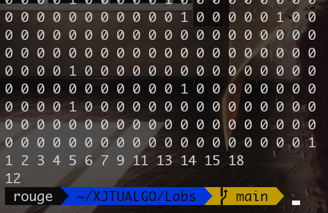

#  回溯/分支界限法 - 实验4报告

| 李雨轩     |
| ---------- |
| 2204112913 |
| 计算机2205 |

## 一、题目描述

给定1个1000行×20列的0-1矩阵，对于该矩阵的任意1列，其中值为1的元素的数量不超过10%。设有两个非空集合A和B，每个集合由矩阵的若干列组成。集合A和B互斥是指对于矩阵的任意一行，同时满足下列2个条件：

​	1）若A中有一个或多个元素在这一行上的值是1，则B中的元素在这一行全部是0；

​	2）若B中有一个或多个元素在这一行上的值是1，则A中的元素在这一行全部是0。请你设计一个算法，找出一对互斥集合A和B，使得A和B包含的列的总数最大。

## 二、问题分析

一个给定的1000行×20列的0-1矩阵中寻找两个互斥的列集合A和B，要求这两个集合中的列的总数最大化。类似于二分图问题。

### 1. 互斥定义

集合A和B被定义为互斥的，如果满足以下条件：
1. 对于矩阵中的任何一行，如果A集合中有列的值为1，则该行B集合中所有列的值必须为0；
2. 同理，如果B集合中有列的值为1，则该行A集合中所有列的值必须为0。

### 2. 问题复杂性

- **稀疏性**：矩阵的每列中值为1的元素数量不超过10%，这说明数据在行向量上是高度稀疏的。
- **维度**：虽然仅有20列，但每列可以独立地选择加入集合A、集合B或不加入，加上列间的互斥条件，大大增加了问题的复杂度。

## 三、算法设计

### 1. 数据结构

1. **矩阵存储**：通过二维数组 `matrix[kMaxUsers][kMaxFeatures]` 来存储输入的0-1矩阵。
2. **选择向量**：利用两个数组 `selectionA[kMaxFeatures]` 和 `selectionB[kMaxFeatures]` 来标记当前递归过程中集合A和B的选择情况。
3. **冲突矩阵**：通过二维布尔数组 `isConflict[kMaxFeatures][kMaxFeatures]` 记录任意两列是否存在冲突，即在同一行中同时为1。

### 2. 深度优先搜索（DFS）实现

1. **递归基**：若当前特征索引 `currentFeature` 等于列总数，即考虑完所有列，检查集合A和B的有效性（互斥）及是否更新最大总列数。
2. **尝试加入A**：
   - 在尝试将当前特征加入集合A之前，先检查与集合B中已选择的任何列是否存在冲突。
   - 若无冲突，将 `selectionA[currentFeature]` 设置为1，并递归调用 `DepthFirstSearch(currentFeature + 1, countA + 1, countB)`。
   - 递归完成后，撤销选择 `selectionA[currentFeature] = 0`。
3. **尝试加入B**：
   - 类似地，检查当前特征加入集合B是否与集合A中已选择的列存在冲突。
   - 若无冲突，将 `selectionB[currentFeature]` 设置为1，并递归调用 `DepthFirstSearch(currentFeature + 1, countA, countB + 1)`。
   - 递归完成后，撤销选择 `selectionB[currentFeature] = 0`。
4. **跳过当前特征**：直接调用 `DepthFirstSearch(currentFeature + 1, countA, countB)`，即不将当前特征加入任何集合。

### 3. 剪枝策略与结果输出

1. 如果 `kMaxFeatures - currentFeature + countA + countB < maxScore`，则可提前终止该路径的搜索，因为即便将剩余所有列都加入A或B，也无法超过已知的最大值。
2. 根据最终找到的最大集合，比较集合A和B的大小，并按大小顺序输出列的索引。

## 四、算法实现：源代码

```cpp
#include <iostream>
#include <cmath>

using namespace std;

const int kMaxUsers = 1000;
const int kMaxFeatures = 20;
int matrix[kMaxUsers][kMaxFeatures], selectionA[kMaxFeatures], selectionB[kMaxFeatures];
bool isConflict[kMaxFeatures][kMaxFeatures];
int maxScore = 0, bestSelectionA[kMaxFeatures], bestSelectionB[kMaxFeatures];

// Function to explore all combinations of features
void DepthFirstSearch(int currentFeature, int countA, int countB) {
    if (kMaxFeatures - currentFeature + countA + countB < maxScore) {
        return; // Pruning the branch if it can't surpass the current max score
    }

    if (currentFeature == kMaxFeatures && countA + countB >= maxScore && countA > 0 && countB > 0) {
        bool isValid = true;
        for (int i = 0; i < kMaxUsers && isValid; i++) {
            bool hasFeatureA = false, hasFeatureB = false;
            for (int j = 0; j < kMaxFeatures; j++) {
                if (selectionA[j] == 1 && matrix[i][j] == 1) hasFeatureA = true;
                if (selectionB[j] == 1 && matrix[i][j] == 1) hasFeatureB = true;
            }
            if (hasFeatureA && hasFeatureB) isValid = false; // Conflict detected
        }

        if (isValid) {
            int sumA = 0, sumB = 0;
            for (int i = 0; i < kMaxFeatures; i++) {
                sumA += bestSelectionA[i];
                sumB += bestSelectionB[i];
            }
            if (abs(countA - countB) < abs(sumA - sumB)) {
                for (int i = 0; i < kMaxFeatures; i++) {
                    bestSelectionA[i] = selectionA[i];
                    bestSelectionB[i] = selectionB[i];
                }
            }
        }

        if (isValid && countA + countB > maxScore) {
            maxScore = countA + countB;
            for (int i = 0; i < kMaxFeatures; i++) {
                bestSelectionA[i] = selectionA[i];
                bestSelectionB[i] = selectionB[i];
            }
        }
    }

    if (currentFeature == kMaxFeatures) return;

    // Try including current feature in set A
    bool canIncludeInA = true, canIncludeInB = true;
    if (countB > 0)
        for (int i = 0; i < kMaxFeatures; i++)
            if (selectionB[i] && isConflict[currentFeature][i]) {
                canIncludeInA = false;
                break;
            }

    if (canIncludeInA) {
        selectionA[currentFeature] = 1;
        DepthFirstSearch(currentFeature + 1, countA + 1, countB);
        selectionA[currentFeature] = 0;
    }

    // Try including current feature in set B
    if (countA > 0)
        for (int i = 0; i < kMaxFeatures; i++)
            if (selectionA[i] && isConflict[currentFeature][i]) {
                canIncludeInB = false;
                break;
            }

    if (canIncludeInB) {
        selectionB[currentFeature] = 1;
        DepthFirstSearch(currentFeature + 1, countA, countB + 1);
        selectionB[currentFeature] = 0;
    }

    // Explore option with excluding current feature from both sets
    DepthFirstSearch(currentFeature + 1, countA, countB);
}

int main() {
    // Input data into the matrix
    for (int i = 0; i < kMaxUsers; i++) 
        for (int j = 0; j < kMaxFeatures; j++) 
            cin >> matrix[i][j];


    // Precompute conflicting features
    for (int i = 0; i < kMaxFeatures; i++) 
        for (int j = i + 1; j < kMaxFeatures; j++) 
            for (int k = 0; k < kMaxUsers; k++) 
                if (matrix[k][i] == 1 && matrix[k][j] == 1) {
                    isConflict[i][j] = true;
                    isConflict[j][i] = true;
                    break;
                }


    // Start the Depth First Search from the first feature
    DepthFirstSearch(0, 0, 0);

    int lengthA = 0, lengthB = 0;
    for(int i = 0; i < kMaxFeatures; i++) {
        if(bestSelectionA[i] == 1) lengthA++;
        if(bestSelectionB[i] == 1) lengthB++;
    }
    if(lengthA > lengthB){
        for(int i = 0; i < kMaxFeatures; i++)
            if(bestSelectionA[i] == 1) cout << i << " ";
        cout << endl;
        for(int i = 0; i < kMaxFeatures; i++)
            if(bestSelectionB[i] == 1) cout << i << " ";
        
    } else {
        for(int i = 0; i < kMaxFeatures; i++)
            if(bestSelectionB[i] == 1) cout << i << " ";
        cout << endl;
        for(int i = 0; i < kMaxFeatures; i++)
            if(bestSelectionA[i] == 1) cout << i << " ";
        
    }

    cout << endl;
    return 0;
}
```

## 五、运行结果：Moodle平台测试用例结果




## 六、实验过程说明

本次实验实现了一个深度优先搜索（DFS）算法，以在一个1000行×20列的0-1矩阵中找到最大的互斥列集合A和B。

首先，从标准输入读取矩阵数据，并初始化两个数组`selectionA`和`selectionB`来追踪集合A和B中各列的选择情况。同时，构建一个布尔型二维数组`isConflict`，用于快速检测任何两列是否在同一行中同时为1。遍历矩阵中的每一对列，若它们在同一行同时为1，则在`isConflict`数组中相应位置标记为`true`。这一步为之后的深度优先搜索提供了剪枝的依据。利用深度优先搜索算法逐列考虑各种可能的组合。在尝试将当前列加入集合A或B之前，先检查此操作是否会导致冲突，以确保每一步的选择都满足互斥条件。在搜索过程中，若当前递归路径的潜在最大列数小于已知的最大值，则提前终止该路径的搜索。这一策略有效缩减了搜索空间，提升了算法效率。每当找到一对有效的集合A和B，若它们的总列数超过当前记录，则更新最大值并保存当前选择状态。最终，根据集合A和B的大小，按顺序输出列的索引。

最后成功的通过了Moodle平台的多个测试用例。