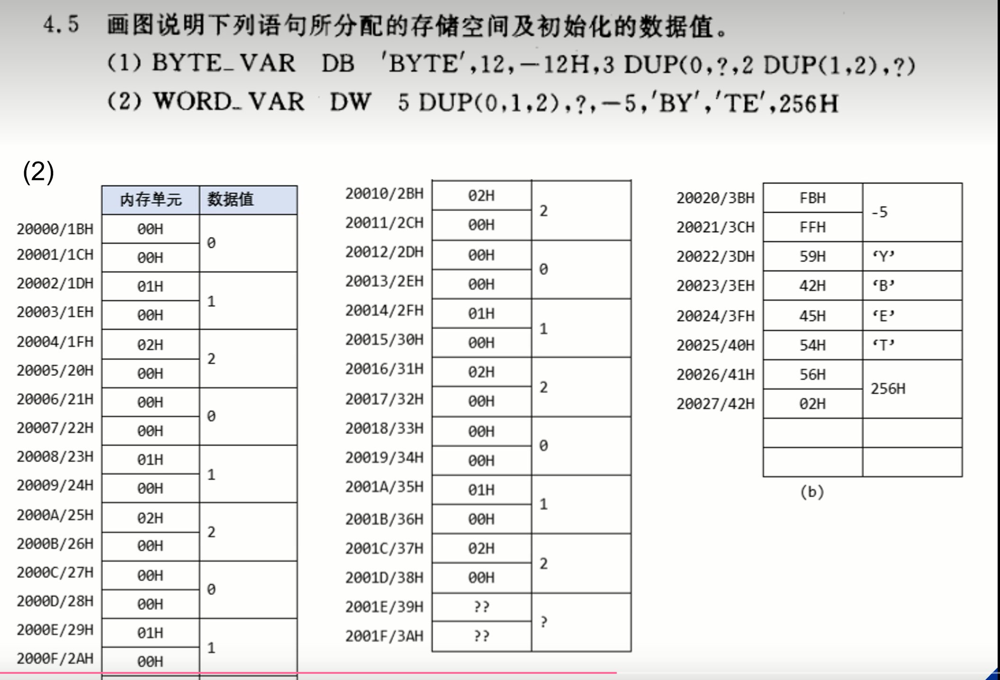
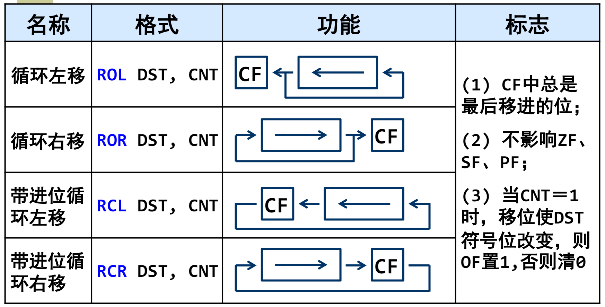
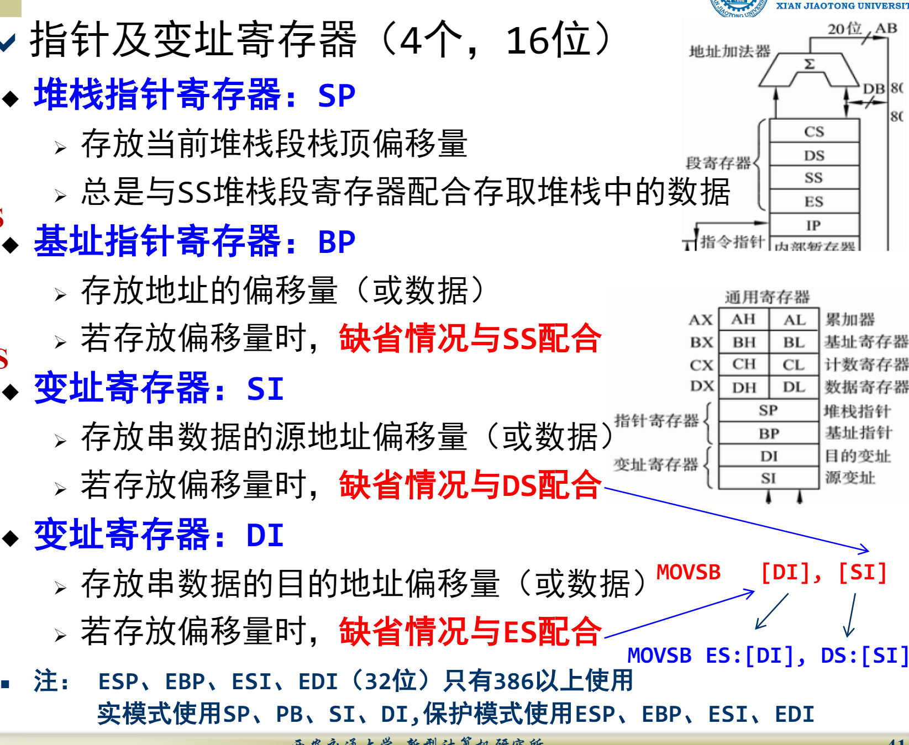
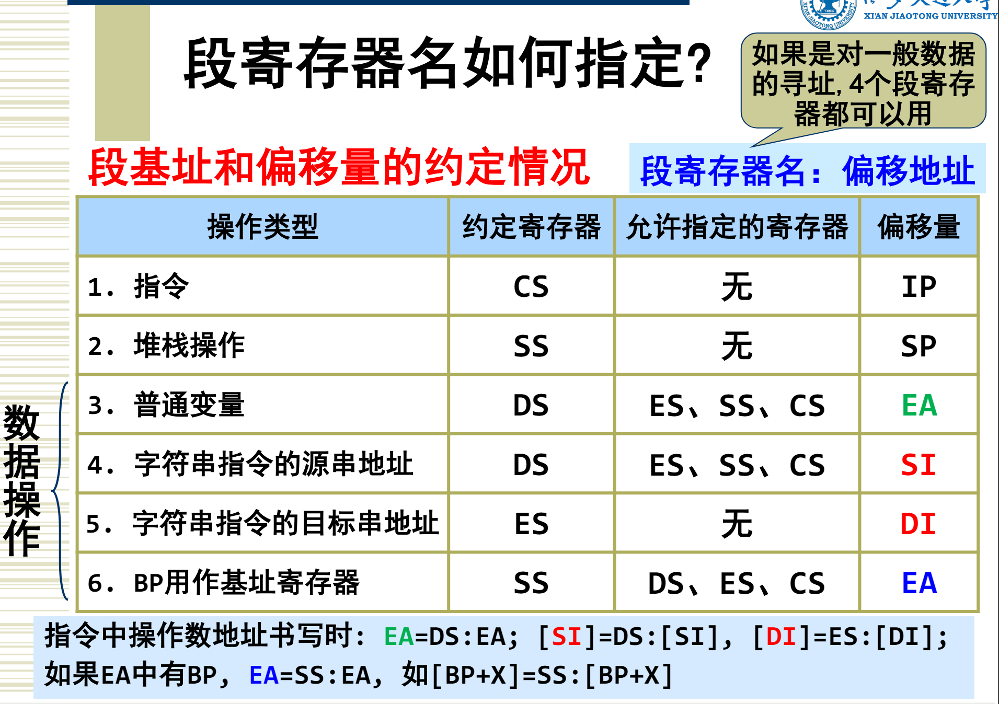
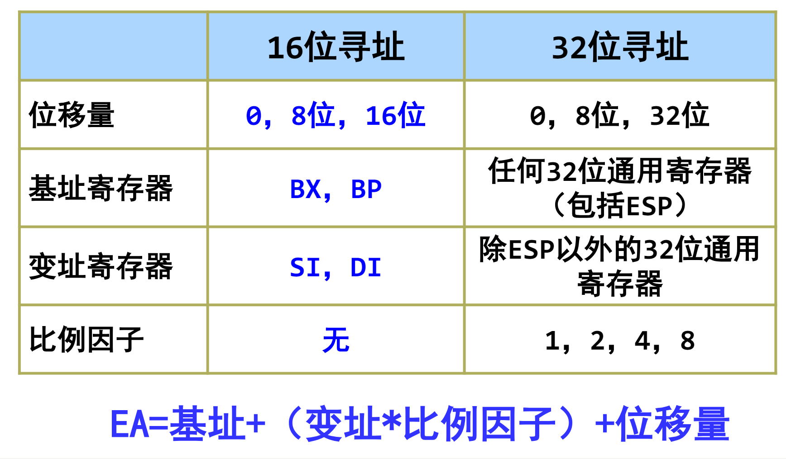
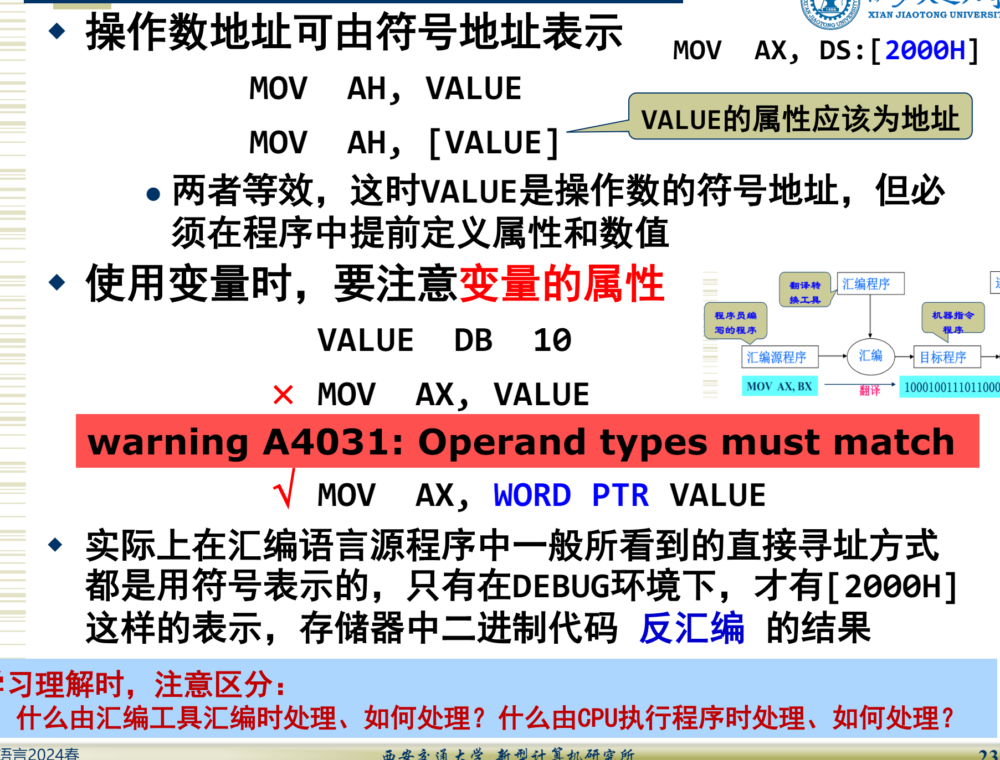
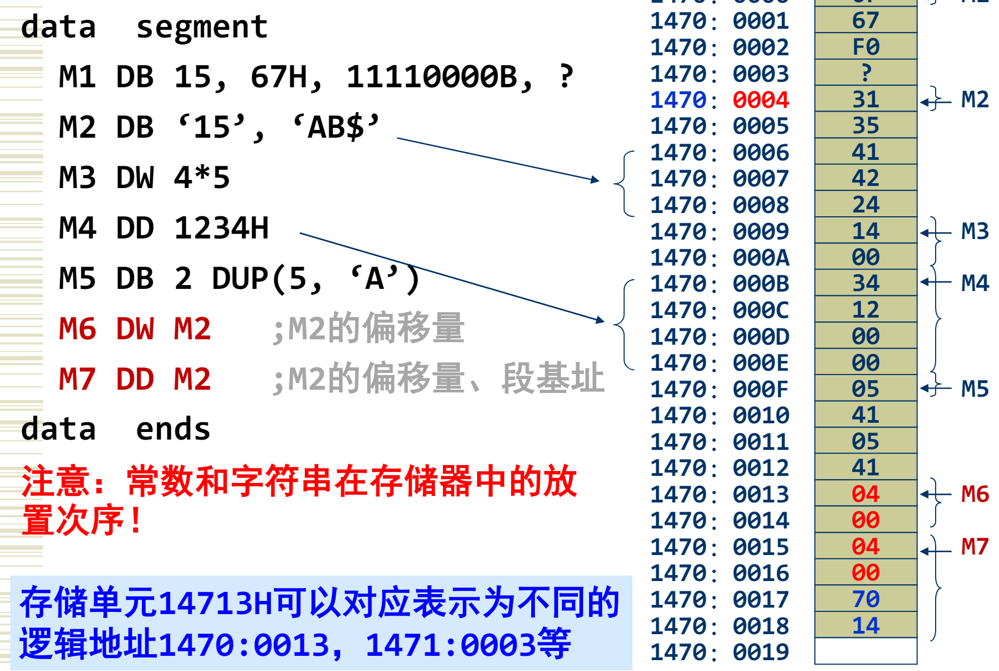
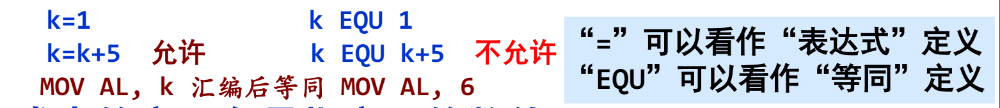
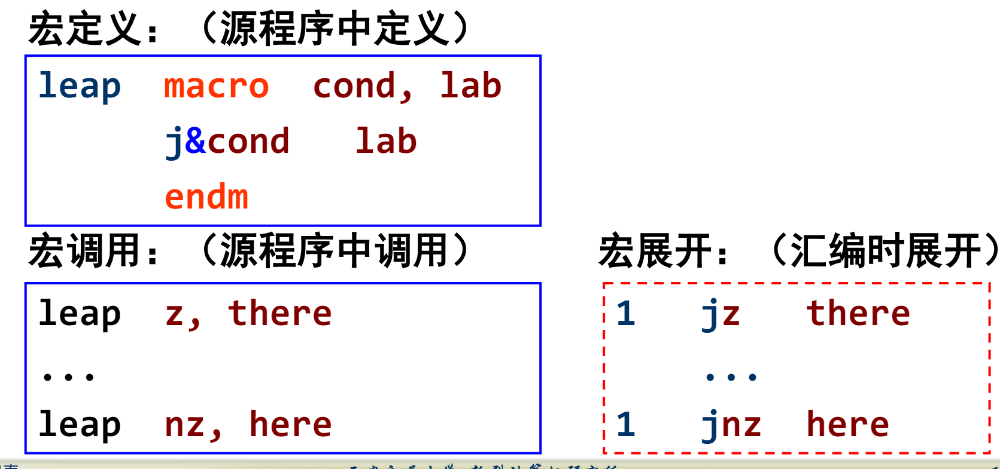
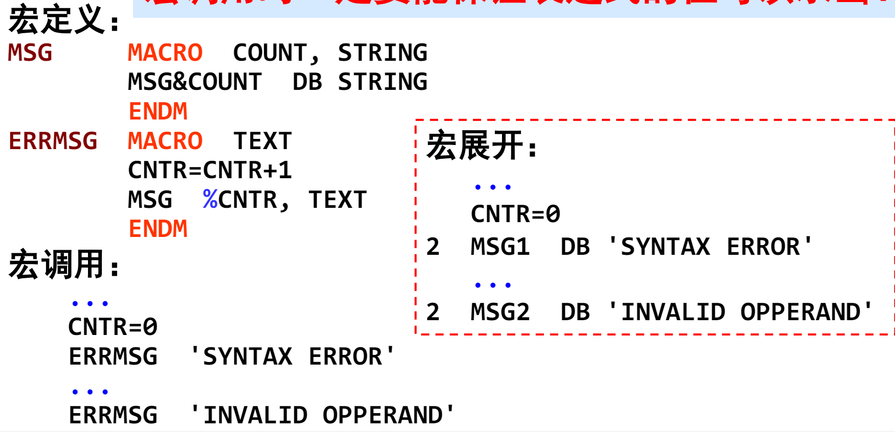

# 8086 Assembly

## CH0 Other

1. 
2. **==一个db中两个dup，取length取的是谁==**
3. **==8086未定义堆栈段时堆栈位置，以及是否需要像处理DS一样处理SS和SP==**
4. **==assume的作用是什么（尤其是多段的时候）==**
5. **==8086汇编中，段地址指的是16位还是20位==**
6. mov ax, buffer \ mov ax, [buffer] \ mov ax, offset buffer \ mov ax, [offset buffer]
7. **==单操作数+Mem（或者两个Mem或一Mem加一IMM的）的一定要表明数据类型，如DEC 【DI】==**


##CH1 汇编机器指令

### 一、数据转移指令

#### 1. MOV，PUSH 和 POP

* push 和POP操作只能对dw进行操作（**16bit，两个字节，一个字**）
* **==为什么`mov ax, [buffer+1]  ; mov ax, [0004h]`不能使用`mov ax, [offset buffer+1]    ;mov ax, 0004h`==**
* PUSH、POP （**==以及似乎只有PUSH，POP，MOV可以操作段寄存器==**）
  * PUSH/POP REG
  * **PUSH/POP MEM**
  * **PUSH/POP ==SEGREG（但不能是CS）==**
  * **不允许立即数操作，也不允许立即数寻址**

#### 2. XLAT

* 换码指令（查表转换指令）:   XLAT    ;al←ds:[bx+al]       **(BX: 字节表格(长度不超过256)首地址的偏移地址)**

#### 3. IN，OUT

* 只限于使用EAX、AX或AL
* 端口号在0～255之间，则端口号直接写在指令中`IN AL, PORT`
* 端口号大于255，则端口号通过DX寄存器间接寻址，即端口号应先放入DX中`IN AL, DX`

#### 4. 串处理指令

* 涉及到寄存器时只能使用累加器

* 目标操作数一定是ES:[DI]，源操作数一定是[SI]  （SI的段前缀可以不是DS）

* MOVS：必须是`MOVS ES: type ptr [DI], DS:[SI]`，其中只有SI的段超越前缀可更改。而目标操作数DI、源操作数SI和DI的段前缀ES都不可变

* STOS：把AL或AX数据传送到目的地址DST  `STOS ES:BYTE PTR[DI]`

  | STOSB | ；字节串存储：ES:[DI]←AL ；DI←DI±1 |
  | ----- | ---------------------------------- |
  | STOSW | ；字串存储：ES:[DI]←AX ；DI←DI±2   |

* LODS：把数据从SRC传送到寄存器AX或AL `LODS DS:NYTE PTR[SI]`

  | LODSB | ；字节串读取：AL←DS:[SI] ；SI←SI±1 |
  | ----- | ---------------------------------- |
  | LODSW | ；字串读取：AX←DS:[SI] ；SI←SI±2   |

* INS和OUTS用的是DX寄存器表示端口号：`INS ES:BYTE PTR[DI], DX`，`OUTS DX, DS:BYTE PTR[SI]`

* CMPS：DST-SRC

* SCAS：DST-AX

#### 5. Load Segment 指令（LDS、LES、LCS、LSS）

* 指令源操作数只能用存储器寻址方式
* 低地址中的16位数据装入指针寄存器，高地址中的16位数据装入段寄存器

### 二、数据处理指令

* **==BCD？==**

#### 1. 加减法

* **==OF、CF：溢出与进位==** [计算机判断溢出的原理？ - 北极的回答 - 知乎](https://www.zhihu.com/question/22199029/answer/55877219)
  * 若CF＝1，对无符号数而言发生了溢出
  * 若OF＝1，对带符号数而言发生了溢出
  * 一旦发生溢出，结果就不正确了
* NEG：理解方式：用**零减去操作数**，然后结果返回操作数
  * 对操作数所能表示的最小负数(例若操作数是8位则为－128)求补，原操作数不变，但OF被置1
  * 当操作数为0时，CF清0；对非0操作数求补后，CF置1

#### 2. 乘除法 IMUL、MUL、IDIV和DIV

* MUL和IMUL
  * 乘积的高一半为0，则CF、OF均为0，否则CF、OF均为1：**这样可以检查结果是字节、字或双字**
  * 乘积的高一半是低一半的符号扩展，则CF、OF均为0，否则CF、OF均为1。 其实质和MUL情况下一样，主要用于判断结果是字节、字或双字
* DIV和IDIV：源操作数不能是立即数

#### 3. 逻辑指令

* 逻辑运算：CF和OF清0，**影响SF、ZF及PF**，AF不定

#### 4. 移位指令

* DST可以是8位、16位或32位的寄存器或存储器操作数
* CF存最后移出去的那一位
* ZF，SF，PF按具体情况设置（循环移位不改）
* OF（CNT为1时，最高位变化则置1）
* 

### 三、跳转指令

#### 1. JMP和JCC

* jmp指令中对于**位移量**和**偏移量**的区分
  * **==区分？？？==**https://blog.csdn.net/weixin_41890599/article/details/99556319
  * **JCC：条件转移指令**只能使用段内直接寻址方式
  * 无条件转移（JMP）和无条件子程序调用（CALL）可用四种方式的任何一种
* 条件转移只能段内短转移short（为什么）还有JCXZ
  * 条件转移指令只能使用**段内直接寻址**方式

#### 2. CALL和RET

* call命令不能短转移（short）
* ret imm8 中， imm8表示额外返回的**字节数（不是字数）**

## CH2 寻址方式

### 一、数据寻址：7种寻址

https://www.cnblogs.com/Hardworking666/p/17374792.html#4_74

#### 1. 基址变址

* 只要指令寻址时使用了BP，计算物理地址时约定段是SS段
* 指令寻址时使用了除BP以外的其它寄存器，计算物理地址时约定段为DS段
* 寄存器间接寻址 和 寄存器相对寻址 中，可以是基址BX，BP；也可以是变址SI，DI
  1. **==若寄存器间接寻址或相对寻址是`mov ax, 80h[di]`，则默认段基地址是ES还是DS==**
* 
* 
* 

#### 2. 关于EA与label



### 二、指令寻址

* short，near ptr
* fat ptr， dword ptr
* https://blog.csdn.net/weixin_41890599/article/details/99556319


## CH3 伪指令

### 一、数据段定义

* 

#### 1. EQU和=

* EQU伪操作中的表达式名是**不允许重复定义**的，而“＝”伪操作中的表达式名则允许重复定义
  * =”可以看作“表达式”定义
  * “EQU”可以看作“等同”定义
  * 
* 表达式中的变量名是指变量的**数值**
* 表达式值汇编时一定要能确定具体数值!

#### 2. 地址计数器

* 在汇编程序对源程序汇编过程中，使用地址计数器保存当前正在汇编的基本处理单位在存储器中的**首地址**（如指令的首地址，操作数首地址）

  * 内容为指令或数据**首字节**存储单元的偏移地址

* ORG 伪操作：用来设置当前地址计数器的值，即分配后续数据、指令的存储器开始地址

  * ORG 常数表达式（n）

  * ```assembly
    vectors segment
    	org 10			 ; 10=000AH
    	vect1 dw 4567h 	    ; 偏移地址值为000AH
    	org 20
    	vect2 dw 9876h        ; 偏移地址值为0014H
    vectors ends
    ```

* EVEN: 使下一个变量或指令地址开始于偶字节地址

  * 使得地址计数器值=2的倍数

* ALIGN 伪操作：

  * 格式：`ALIGN boundary`；其中`boundary`必须是$2^n$

#### 3. LAbel

* 名字项：可以是指令标号或伪操作的变量、过程名、段名，**数字不能出现在名字的第一个字符位置**
* 标号/变量 有3个属性：段地址 偏移地址 类型
* **==如何区分标号和变量==**

#### 4. 关系运算符

* EQ、NE、LT、GT、LE、GE
* 关系运算符的两个操作数是数字或同一段内的两个存储器地址
* 计算的结果应为逻辑值
  * 结果为真，逻辑值=**0FFFFH**；
  * 结果为假，逻辑值= **0000H**

#### 5. 数值回送操作符

* Length+变量 回送由 `dup` 定义的变量的数据个数，其他情况返回 1
* SIZE+变量：功能 LENGTH*TYPE
* TYPE+变量（或标号）：
  * 变量：DB-1、DW-2、DD-4、DQ-8、DT-10
  * 标号：NEAR-$-1$、FAR-$-2$


### 二、宏定义：结尾直接ENDM，不是NAME+ENDM

#### 1. 符号1&符号2

* 文本替换操作符。宏展开时，合并前后两个符号形成一个符号
* 符号可以是操作码、操作数或是一个字符串
* 

#### 2. %表达式

* 将%后面的表达式立即求值转换为数字，并在展开时用这个数取代哑元，宏调用时使用
* 
* **==如上图的`cnrt=cntr+1`什么时候使用不会体现在代码中==**

#### 3. `:REQ`和`:=<>`

* `:REQ`: 指定某个变元必须有。调用时必须有对应的实元，否则汇编时出**错**
* `:=`: 为宏变元提供缺省值

#### 4. 重复汇编

* ```assembly
  array label byte
  	IRP K, <1,2,3,4,5>
      	db 'NO.&K'
  	ENDM
  ```

* ```assembly
  array label byte
  IRPC K, 12345
  	db 'NO.&K'
  ENDM
  ```

* IRP是<>内的元素，K是哑元

* IRPC是字符串内的每个字符

## CH4 IO与中断

### 一、IO相关

* 从程序设计的角度看，接口由一组寄存器组成，是完成输入输出的桥梁
* 端口地址64kB个，但是端口地址：只有两种方式给出
  * 直接寻址：PORT（00H～FFH）
  * 寄存器间接寻址：DX（0000H～FFFFH)
* 累加器：只能使用累加器：
  * AX（16位字操作）
  * AL（8位字节操作）
* 高速：直接存储器存取（DMA)方式
* 低速：中断

#### 1. 程序直接控制I/O方式

* 在输入输出之前首先查询外设的状态

* ```assembly
  WAIT：
          IN AL, 72H ; 读取输入口的状态
          TEST AL, 80H ; 测试状态寄存器的最高,80H=10000000B
          JZ WAIT ; 若状态位=0，则继续测试等待

          MOV AL, VAR
          OUT 70H, AL ; 输出数据
  ```

### 二、中断相关

#### 1. 中断命令寄存器

* ```assembly
  IN AL, 20H
  OR AL, 20H ; 00100000B
  OUT 20H, AL
  ```

* 结束硬件中断指令：中断服务程序中，硬件中断处理结束前，应**将EOI置1**

* 硬件中断服务程序结束前要有这几条指令

#### 2. 中断分类

* 外部中断
  * 可屏蔽外部中断
  * 不可屏蔽外部中断（int 2）
* 内部中断（**都不可屏蔽**）
  * 除零（int 0）
  * 。。。

#### 3. 中断时CPU响应过程

* 读取中断类型号N
* pushf
* 保存被中断程序断点（push cs + push ip）
* 禁止硬件中断和单步中断 （IF = 0 + TF = 0）
* 设置CS：IP （CS = 0000:[4$\times$N + 2] + IP = 0000:[4$\times$N]）

#### 4. 一般中断处理程序设计格式：注意关中断和开中断时机 和 EOI

* 保存现场：寄存器入栈
* **开中断和TF（可选）**
* 中断处理程序主体
* **中断结束（EOI）(硬件中断时)**
* **关中断(CLI)**
* 恢复现场
* **I**RET


### 三、DOS系统调用

#### 1. 存取中断向量的DOS功能调用

* **设置**中断向量
  * 预置: AH=25H（子功能号）
  * AL=中断类型号
  * DS:DX=中断向量（中断程序入口地址）
* **读取**中断向量
  * 预置: AH=35H（子功能号）
  * AL=中断类型号
  * 返回: ES:BX=中断向量（中断程序入口地址）

